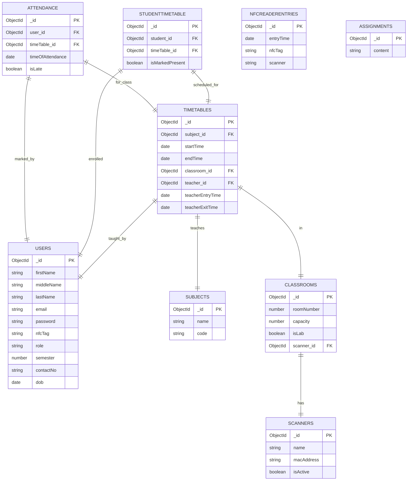
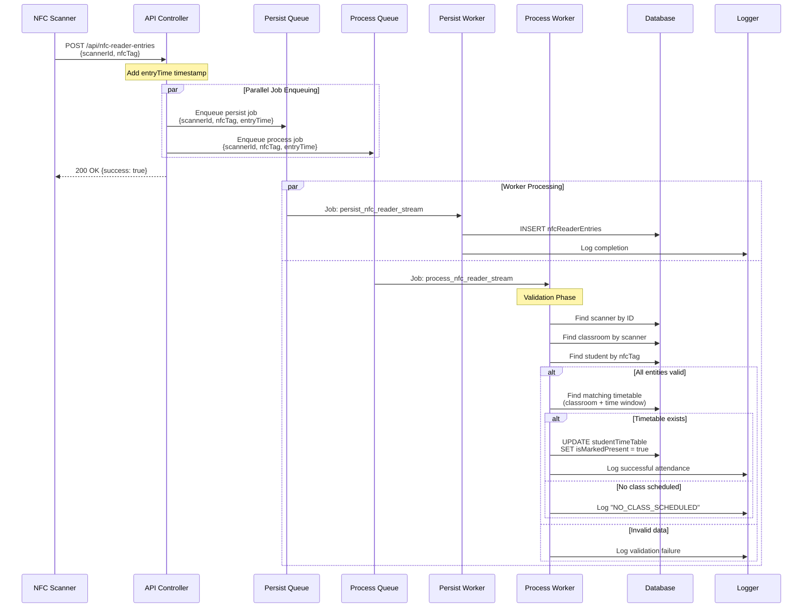
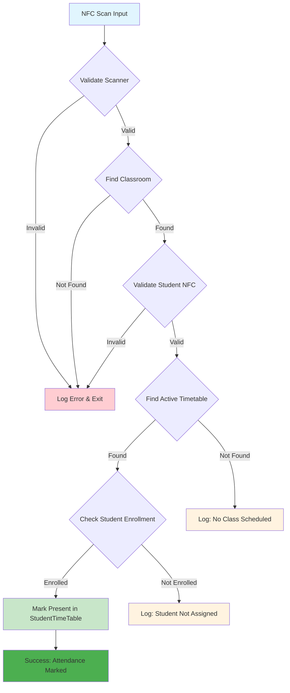

# 📊 Smart Campus Database Documentation

## 🏗️ Database Overview

The Smart Campus application uses **MongoDB** with **Mongoose ODM** for data management. The database follows a microservices-oriented design with clear separation of concerns and consistent naming conventions.

### 🔧 Common Features
- **Soft Delete**: All models use `mongoose-delete` plugin for soft deletion
- **Timestamps**: Most models include `createdAt` and `updatedAt` fields
- **Plural Collections**: All collections use plural naming (e.g., `users`, `classrooms`)

---

## 📋 Database Models

### 1. 👥 Users Collection (`users`)
**Purpose**: Central user management for students, teachers, and administrators

```javascript
{
  firstName: String (required),
  middleName: String (optional),
  lastName: String (optional),
  gender: String (enum: ["male", "female"]),
  dob: Date,
  email: String (required),
  password: String (required),
  address: String,
  contactNo: String,
  nfcTag: String, // For NFC-based attendance
  role: String (required, enum: ["admin", "student", "teacher"]),
  college: String,
  courseName: String,
  branch: String,
  parentContactNo: String, // Students only
  semester: Number (enum: [1,2,3,4,5,6,7,8]) // Students only
}
```

### 2. 📚 Subjects Collection (`subjects`)
**Purpose**: Academic subject definitions

```javascript
{
  name: String (required),
  code: String (required)
}
```

### 3. 🏫 Classrooms Collection (`classrooms`)
**Purpose**: Physical classroom management with NFC scanner integration

```javascript
{
  roomNumber: Number (required),
  capacity: Number (required),
  isLab: Boolean (default: false),
  scanner: ObjectId → scanners (required)
}
```

### 4. 📡 Scanners Collection (`scanners`)
**Purpose**: NFC scanner device management

```javascript
{
  name: String (required),
  macAddress: String,
  isActive: Boolean (default: true)
}
```

### 5. 📅 TimeTables Collection (`timeTables`)
**Purpose**: Class schedule definition linking subjects, classrooms, and teachers

```javascript
{
  subject: ObjectId → subjects (required),
  startTime: Date (required),
  endTime: Date (required),
  classroom: ObjectId → classrooms (required),
  teacher: ObjectId → users (required),
  teacherEntryTime: Date,
  teacherExitTime: Date
}
```

### 6. 👨‍🎓 StudentTimeTable Collection (`studentTimeTable`)
**Purpose**: Links students to specific timetable entries and tracks presence status

```javascript
{
  student: ObjectId → users (required),
  timeTable: ObjectId → timeTables (required),
  isMarkedPresent: Boolean (default: false)
}
```

### 7. ✅ Attendance Collection (`attendance`)
**Purpose**: Records actual attendance events with timing details

```javascript
{
  user: ObjectId → users (required),
  timeTable: ObjectId → timeTables (required),
  timeOfAttendance: Date (default: Date.now),
  isLate: Boolean (default: false)
}
```

### 8. 📊 NfcReaderEntries Collection (`nfcReaderEntries`)
**Purpose**: Raw NFC scan data logging

```javascript
{
  entryTime: Date (default: Date.now),
  nfcTag: String (required),
  scanner: String → scanner (required)
}
```
*Note: Has time-based index for efficient queries*

### 9. 📝 Assignments Collection (`assignments`)
**Purpose**: Assignment content management (basic implementation)

```javascript
{
  content: String (default: "")
}
```

---

## 🔗 Entity Relationship Diagram



---

## 🔄 Data Flow Architecture

### NFC Attendance Processing Flow



### Database Query Patterns



---

## 🎯 Key Design Patterns

### 1. **Role-Based User Model**
- Single `users` collection handles all user types
- Role field determines permissions and available fields
- Students have additional fields (semester, parentContactNo)

### 2. **Timetable-Centric Architecture**
- `timeTables` is the central scheduling entity
- Links subjects, classrooms, teachers, and time slots
- `studentTimeTable` creates many-to-many relationship with students

### 3. **Dual Attendance System**
- `studentTimeTable.isMarkedPresent`: Quick boolean flag
- `attendance`: Detailed records with timing and late status

### 4. **Asynchronous Processing**
- Raw NFC data immediately persisted
- Business logic processed in background
- Parallel job execution for performance

### 5. **Soft Delete Pattern**
- All models support soft deletion
- Data integrity maintained for historical records
- Easy restoration of accidentally deleted data

---

## 📈 Performance Considerations

### Indexes
- `nfcReaderEntries` has time-based index: `{ entryTime: 1 }`
- Consider adding compound indexes for frequent queries:
  - `users`: `{ nfcTag: 1, role: 1 }`
  - `timeTables`: `{ classroom: 1, startTime: 1, endTime: 1 }`
  - `studentTimeTable`: `{ student: 1, timeTable: 1 }`

### Query Optimization
- Use `Promise.all()` for parallel database operations
- Population strategy for related documents
- Time-window queries for timetable matching

---

## 🔒 Security & Data Integrity

### Access Control
- Role-based authorization in routes
- User creation restricted to admin/teachers
- Soft delete prevents accidental data loss

### Data Validation
- Required fields enforced at schema level
- Enum validation for roles and semesters
- Reference integrity through ObjectId relationships

### Audit Trail
- Timestamps on all relevant models
- NFC entry logging for debugging
- Comprehensive error logging in workers

---

This documentation provides a complete overview of your Smart Campus database structure. The design supports efficient attendance tracking through NFC technology while maintaining data integrity and audit capabilities.


<!-- <agentComponentType>chat-answer</agentComponentType> -->

<!-- <rawResChunk><answer><details>
<summary>🧩 Analysis chain</summary>

@Nebula-2003, I'll create comprehensive documentation for your database structure including all models, relationships, and flow diagrams. Let me first gather all the model files to analyze the complete database schema.

---

🏁 Script executed:
```
#!/bin/bash
# Find all model files in the services directory
echo "=== Database Model Files ==="
fd -e js -p "model\.js$" api/services/

echo -e "\n=== Reading all model files ==="
fd -e js -p "model\.js$" api/services/ --exec echo "=== {} ===" \; --exec cat {}

echo -e "\n=== Checking for any additional schema files ==="
rg -t js "mongoose\.model|Schema" api/services/ -A 2 -B 2
```

Length of output: 17863

---

Now let me analyze the background jobs to understand the complete data flow:

---

🏁 Script executed:
```
#!/bin/bash
# Check the background jobs to understand data flow
echo "=== Background Jobs Implementation ==="
cat api/jobs/backgroundJobs.js

echo -e "\n=== NFC Reader Controller Flow ==="
cat api/services/nfcReaderEntries/nfcReaderEntries.controller.js
```

Length of output: 6146

---


</details>

Perfect! Now I have all the information needed to create comprehensive database documentation. Here's the complete documentation for your Smart Campus database structure:

# 📊 Smart Campus Database Documentation

## 🏗️ Database Overview

The Smart Campus application uses **MongoDB** with **Mongoose ODM** for data management. The database follows a microservices-oriented design with clear separation of concerns and consistent naming conventions.

### 🔧 Common Features
- **Soft Delete**: All models use `mongoose-delete` plugin for soft deletion
- **Timestamps**: Most models include `createdAt` and `updatedAt` fields
- **Plural Collections**: All collections use plural naming (e.g., `users`, `classrooms`)

---

## 📋 Database Models

### 1. 👥 Users Collection (`users`)
**Purpose**: Central user management for students, teachers, and administrators

```javascript
{
  firstName: String (required),
  middleName: String (optional),
  lastName: String (optional),
  gender: String (enum: ["male", "female"]),
  dob: Date,
  email: String (required),
  password: String (required),
  address: String,
  contactNo: String,
  nfcTag: String, // For NFC-based attendance
  role: String (required, enum: ["admin", "student", "teacher"]),
  college: String,
  courseName: String,
  branch: String,
  parentContactNo: String, // Students only
  semester: Number (enum: [1,2,3,4,5,6,7,8]) // Students only
}
```

### 2. 📚 Subjects Collection (`subjects`)
**Purpose**: Academic subject definitions

```javascript
{
  name: String (required),
  code: String (required)
}
```

### 3. 🏫 Classrooms Collection (`classrooms`)
**Purpose**: Physical classroom management with NFC scanner integration

```javascript
{
  roomNumber: Number (required),
  capacity: Number (required),
  isLab: Boolean (default: false),
  scanner: ObjectId → scanners (required)
}
```

### 4. 📡 Scanners Collection (`scanners`)
**Purpose**: NFC scanner device management

```javascript
{
  name: String (required),
  macAddress: String,
  isActive: Boolean (default: true)
}
```

### 5. 📅 TimeTables Collection (`timeTables`)
**Purpose**: Class schedule definition linking subjects, classrooms, and teachers

```javascript
{
  subject: ObjectId → subjects (required),
  startTime: Date (required),
  endTime: Date (required),
  classroom: ObjectId → classrooms (required),
  teacher: ObjectId → users (required),
  teacherEntryTime: Date,
  teacherExitTime: Date
}
```

### 6. 👨‍🎓 StudentTimeTable Collection (`studentTimeTable`)
**Purpose**: Links students to specific timetable entries and tracks presence status

```javascript
{
  student: ObjectId → users (required),
  timeTable: ObjectId → timeTables (required),
  isMarkedPresent: Boolean (default: false)
}
```

### 7. ✅ Attendance Collection (`attendance`)
**Purpose**: Records actual attendance events with timing details

```javascript
{
  user: ObjectId → users (required),
  timeTable: ObjectId → timeTables (required),
  timeOfAttendance: Date (default: Date.now),
  isLate: Boolean (default: false)
}
```

### 8. 📊 NfcReaderEntries Collection (`nfcReaderEntries`)
**Purpose**: Raw NFC scan data logging

```javascript
{
  entryTime: Date (default: Date.now),
  nfcTag: String (required),
  scanner: String → scanner (required)
}
```
*Note: Has time-based index for efficient queries*

### 9. 📝 Assignments Collection (`assignments`)
**Purpose**: Assignment content management (basic implementation)

```javascript
{
  content: String (default: "")
}
```

---

## 🔗 Entity Relationship Diagram


---

## 🔄 Data Flow Architecture

### NFC Attendance Processing Flow

```mermaid
sequenceDiagram
    participant NFC as NFC Scanner
    participant API as API Controller
    participant PQ as Persist Queue
    participant PR as Process Queue
    participant PW as Persist Worker
    participant PRW as Process Worker
    participant DB as Database
    participant LOG as Logger

    NFC->>API: POST /api/nfc-reader-entries<br/>{scannerId, nfcTag}
    
    Note over API: Add entryTime timestamp
    
    par Parallel Job Enqueuing
        API->>PQ: Enqueue persist job<br/>{scannerId, nfcTag, entryTime}
        API->>PR: Enqueue process job<br/>{scannerId, nfcTag, entryTime}
    end
    
    API--&gt;>NFC: 200 OK {success: true}
    
    par Worker Processing
        PQ->>PW: Job: persist_nfc_reader_stream
        PW->>DB: INSERT nfcReaderEntries
        PW->>LOG: Log completion
        
        and
        
        PR->>PRW: Job: process_nfc_reader_stream
        
        Note over PRW: Validation Phase
        PRW->>DB: Find scanner by ID
        PRW->>DB: Find classroom by scanner
        PRW->>DB: Find student by nfcTag
        
        alt All entities valid
            PRW->>DB: Find matching timetable<br/>(classroom + time window)
            
            alt Timetable exists
                PRW->>DB: UPDATE studentTimeTable<br/>SET isMarkedPresent = true
                PRW->>LOG: Log successful attendance
            else No class scheduled
                PRW->>LOG: Log "NO_CLASS_SCHEDULED"
            end
        else Invalid data
            PRW->>LOG: Log validation failure
        end
    end
```

### Database Query Patterns

```mermaid
flowchart TD
    A[NFC Scan Input] --&gt; B{Validate Scanner}
    B --&gt;|Valid| C{Find Classroom}
    B --&gt;|Invalid| Z[Log Error & Exit]
    
    C --&gt;|Found| D{Validate Student NFC}
    C --&gt;|Not Found| Z
    
    D --&gt;|Valid| E{Find Active Timetable}
    D --&gt;|Invalid| Z
    
    E --&gt;|Found| F{Check Student Enrollment}
    E --&gt;|Not Found| Y[Log: No Class Scheduled]
    
    F --&gt;|Enrolled| G[Mark Present in StudentTimeTable]
    F --&gt;|Not Enrolled| X[Log: Student Not Assigned]
    
    G --&gt; H[Success: Attendance Marked]
    
    style A fill:#e1f5fe
    style G fill:#c8e6c9
    style H fill:#4caf50
    style Z fill:#ffcdd2
    style Y fill:#fff3e0
    style X fill:#fff3e0
```

---

## 🎯 Key Design Patterns

### 1. **Role-Based User Model**
- Single `users` collection handles all user types
- Role field determines permissions and available fields
- Students have additional fields (semester, parentContactNo)

### 2. **Timetable-Centric Architecture**
- `timeTables` is the central scheduling entity
- Links subjects, classrooms, teachers, and time slots
- `studentTimeTable` creates many-to-many relationship with students

### 3. **Dual Attendance System**
- `studentTimeTable.isMarkedPresent`: Quick boolean flag
- `attendance`: Detailed records with timing and late status

### 4. **Asynchronous Processing**
- Raw NFC data immediately persisted
- Business logic processed in background
- Parallel job execution for performance

### 5. **Soft Delete Pattern**
- All models support soft deletion
- Data integrity maintained for historical records
- Easy restoration of accidentally deleted data

---

## 📈 Performance Considerations

### Indexes
- `nfcReaderEntries` has time-based index: `{ entryTime: 1 }`
- Consider adding compound indexes for frequent queries:
  - `users`: `{ nfcTag: 1, role: 1 }`
  - `timeTables`: `{ classroom: 1, startTime: 1, endTime: 1 }`
  - `studentTimeTable`: `{ student: 1, timeTable: 1 }`

### Query Optimization
- Use `Promise.all()` for parallel database operations
- Population strategy for related documents
- Time-window queries for timetable matching

---

## 🔒 Security & Data Integrity

### Access Control
- Role-based authorization in routes
- User creation restricted to admin/teachers
- Soft delete prevents accidental data loss

### Data Validation
- Required fields enforced at schema level
- Enum validation for roles and semesters
- Reference integrity through ObjectId relationships

### Audit Trail
- Timestamps on all relevant models
- NFC entry logging for debugging
- Comprehensive error logging in workers

---

This documentation provides a complete overview of your Smart Campus database structure. The design supports efficient attendance tracking through NFC technology while maintaining data integrity and audit capabilities.</answer></rawResChunk> -->