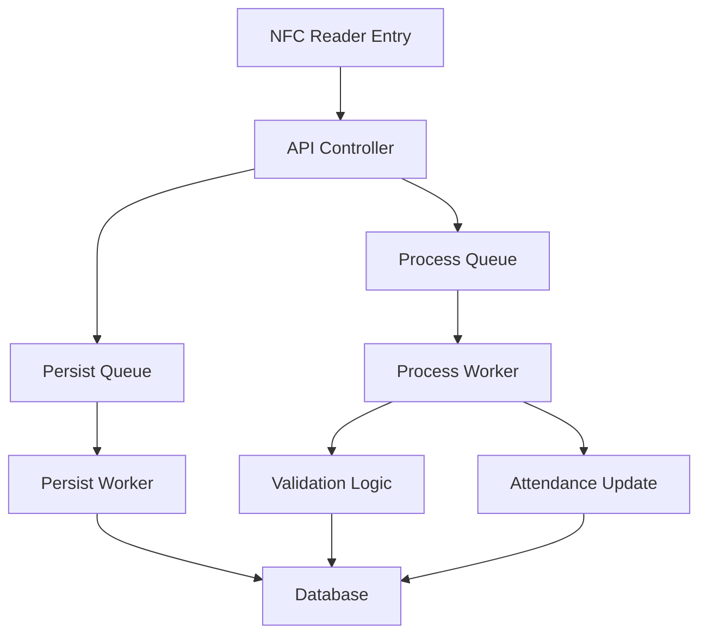

```mermaid
graph TD
    A[NFC Reader Entry] --> B[API Controller]
    B --> C[Persist Queue]
    B --> D[Process Queue]
    C --> E[Persist Worker]
    D --> F[Process Worker]
    E --> G[Database]
    F --> H[Validation Logic]
    F --> I[Attendance Update]
    H --> G
    I --> G
```